  

  

---

<table>
  <tr>
    <td width="60%" valign="top">
      <h2>👋 Hey, I'm Jaydeep!</h2>
      
I'm a <strong>System Architect & Founder</strong> at <a href="https://scaibu.co.in"><strong>Scaibu</strong></a>, based in Bengaluru, India.

      
I design and engineer mission-critical <strong>distributed backends</strong>, <strong>high-throughput streaming topologies</strong>, <strong>production AI/ML pipelines with Vector Databases</strong>, and <strong>self-healing cloud infrastructure</strong> across Google Cloud, TensorFlow, and Terraform.

      <ul>
        <li>⚡ Architecting systems benchmarked at <strong>1M+ requests in 3 minutes</strong> with sub-15ms p99 latency</li>
        <li>🛡️ Implementing progressive canary delivery, automated rollbacks, and 99.99% SLO governance</li>
        <li>🧠 Designing dense semantic search engines & Agentic AI workflows</li>
        <li>✍️ Author of <strong>300+ technical deep dives</strong> on Medium</li>
      </ul>
      
🟢 <strong>Currently open for System Architect roles, Advisory & Consulting — Remote Worldwide!</strong>

    </td>
    <td width="40%" align="center" valign="middle">
      
    </td>
  </tr>
</table>

---

## 📊 SRE Performance Benchmarks & SLO Matrix

| Metric / Dimension | Target / Benchmark | Architectural Implementation |
|---|---|---|
| **🚀 Peak Ingestion & Scale** | **1,000,000+ Requests in 3 mins** | Asynchronous non-blocking I/O event loops, connection pooling, and multi-threaded stream workers. |
| **⏱️ Latency Budget (p99)** | **< 15ms** | In-memory Redis caching layers, zero-copy serialization, and kernel-level socket optimizations. |
| **🛡️ Reliability & SLO** | **99.99% High Availability** | 4-stage progressive canary deployment (`5% → 25% → 50% → 100%`) with automatic sub-5s rollbacks. |
| **🔄 Event Streaming Flow** | **50k+ msgs / sec** | Partition-aware Apache Kafka pipelines with idempotent consumer offsets and zero-data-loss guarantees. |
| **📐 Vector Search Retrieval** | **< 20ms p95** | Hierarchical semantic chunking with HNSW indexed vector spaces across Pinecone, Qdrant & pgvector. |
| **📦 Modular Reusability** | **90+ Composable Packages** | Schema-driven anti-corruption adapters and generic data engines for instant plug-and-play reuse. |

---

## 🏗️ How I Architect for Extreme Scale, Progressive Delivery & Reusability

### 1. 🚦 Progressive Canary Delivery & Zero-Blast-Radius Deployments
* **Weighted Traffic Shifting**: Integrated Argo Rollouts and Traefik TrafficSplit CRDs to gradually promote new binaries across 4 structured soak phases (`5% → 25% → 50% → 100%`).
* **Automated Rollback Safeguards**: Prometheus metrics continuously evaluate p99 latency ceilings and HTTP 5xx error thresholds, automatically aborting unhealthy rollouts in **under 5 seconds**.

### 2. 🔄 Extreme Scale & Zero-Bottleneck Concurrency
* **High-Throughput Partitioning**: Designed streaming pipelines to absorb sudden traffic spikes (such as flash sales or real-time telemetry) by sharding workloads across dynamically-rebalanced Kafka partitions.
* **Distributed Concurrency Primitives**: Engineered custom high-performance async mutex locking ([`scaibu_mutex_lock`](https://github.com/Scaibu/scaibu_mutex_lock)) to eliminate race conditions without sacrificing throughput.

### 3. 🧩 Data-Driven Composable Foundations (Zero Boilerplate)
* **Contract-Driven Anti-Corruption Layer**: Universal `fromApi`/`toApi` transform pipelines that isolate backend contract changes from UI and business domains.
* **Generic Adaptor & Saga Engines**: Reusable CRUD adapters, Redux-Saga workers, and rules engines that eliminate hand-rolled repetitive logic across 90+ microservices.

---

## 🛠️ Tech Stack & Architecture Ecosystem

### 🧠 Machine Learning & Deep Learning

### 📐 Vector Databases & Semantic Search

### 🤖 LLMs, Generative AI & Agentic Architectures

### ☁️ Cloud, DevOps & Infrastructure as Code (IaC)

### ⚡ Backend & Distributed Systems

### 💻 Frontend & Mobile

---

## 📊 Live Automatically-Updated GitHub Activity & Stats

  
  

 

  

---

## ✍️ Featured Articles & System Design Research

> I write production-depth technical articles on distributed systems, backend architecture, RAG, & AI — **300+ published on Medium.**

| | Article | Tag | Read |
|---|---|---|---|
| 🔥 | [Why Replication Is One of the Hardest Problems in Distributed Systems](https://medium.com/codetodeploy/why-replication-is-one-of-the-hardest-problems-in-distributed-systems-960de0117657) | `Distributed Systems` | 20 min |
| 🔥 | [The Physics of Payment Systems: Why Exactly-Once Semantics Fail in Practice](https://medium.com/h7w/the-physics-of-payment-systems-why-exactly-once-semantics-fail-in-practice-895b5616baa0) | `Backend` | 15 min |
| 🔥 | [From Minutes to Milliseconds: Docker Build Optimization](https://medium.com/h7w/from-minutes-to-milliseconds-docker-build-optimization-0bbc706ec692) | `DevOps` | 117 min |
| 🔥 | [Hierarchical Semantic Chunking](https://medium.com/h7w/hierarchical-semantic-chunking-129bb46bba92) | `AI / RAG / Vectors` | 15 min |
| 📖 | [Retry, Error Handling & Idempotency: The Hidden Science Behind Reliable Distributed Systems](https://medium.com/@scaibu) | `Distributed Systems` | 48 min |
| 📖 | [Stop Building Slow Systems: Master Advanced Queuing & Flow Control](https://medium.com/@scaibu) | `Backend` | 41 min |

---

## 🚀 Featured Architecture Projects

| Project | Description | Stack |
|---|---|---|
| 📊 [llm-observability-platform](https://github.com/Scaibu/llm-observability-platform) | LLM monitoring & observability dashboard | `Python` `TypeScript` `Vector DB` |
| 🛒 [ProcureIQ](https://github.com/Scaibu/ProcureIQ) | AI-powered enterprise procurement platform | `Next.js` `Python` `LangChain` |
| 🔄 [kafka-messaging-pipeline](https://github.com/Scaibu/kafka-messaging-pipeline) | High-throughput event-driven microservice pipeline | `Node.js` `Kafka` `Docker` |
| 🌐 [a2a-demo](https://github.com/Scaibu/a2a-demo) | Google A2A Protocol demo with LangGraph & AI Agents | `Python` `Google Cloud` `Gemini` |
| 🔒 [scaibu_mutex_lock](https://github.com/Scaibu/scaibu_mutex_lock) | High-performance async concurrency lock for Dart/Flutter | `Dart` `Flutter` |

---

## 💼 Hire Me / Let's Connect

**I'm available for the following opportunities:**

✅ System Architect &nbsp;|&nbsp; ✅ Distributed Systems & AI Consulting &nbsp;|&nbsp; ✅ High-Scale Engineering Advisory &nbsp;|&nbsp; ✅ Remote Worldwide

---

## 🏛️ Reference System Architecture Topology (Kubernetes & SRE Plane)

```mermaid
graph TD
    subgraph ExternalClients ["External Clients & Telemetry Sources"]
        ExtClient["Client Applications & SDKs"]
        NodePortVIP["NodePort / Host Port Ingress VIP (31410 - 31427)"]
    end

    subgraph ControlPlane ["Kubernetes Control Plane (Master Node)"]
        KubeAPI["kube-apiserver"]
        DeployCtrl["Deployment Controller"]
        EndpointCtrl["EndpointSlice Controller"]
        CoreDNS["CoreDNS Cluster Resolver (10.96.0.10)"]
    end

    subgraph DataPlaneStorage ["Persistent Storage Subsystem"]
        CSI_Driver["local-path StorageClass Driver"]
        PVC_Alloy["alloydb-data-pvc (20Gi)"]
        PVC_CH["clickhouse-data-pvc (50Gi)"]
        PVC_Kafka["kafka-data-pvc (30Gi)"]
        PVC_Tempo["tempo-data-pvc (20Gi)"]
        PVC_Grafana["grafana-data-pvc (5Gi)"]
    end

    subgraph NodeWorkers ["Kubernetes Worker Node (Namespace: llmobs)"]
        subgraph StatefulCluster ["Stateful Cluster Services (Strategy: Recreate)"]
            Pod_Alloy["AlloyDB Omni (Pod: 5432)"]
            Pod_CH["ClickHouse Server (Pod: 8123/9000)"]
            Pod_Kafka["Apache Kafka KRaft (Pod: 9092)"]
            Pod_Tempo["Grafana Tempo (Pod: 3200)"]
        end

        subgraph StatelessCluster ["Stateless Ingestion & UI (Strategy: RollingUpdate)"]
            Pod_Redis["Redis Ledger Cache (Pod: 6379)"]
            Pod_OTel["OTel Collector Contrib (Pod: 4318/13133)"]
            Pod_Grafana["Grafana Portal UI (Pod: 3000)"]
            Pod_Temporal["Temporal Workflow Engine (Pod: 7233)"]
        end

        subgraph CanaryRollout ["Progressive Delivery (Strategy: Canary)"]
            Pod_CanaryStable["Service Registry Stable (95%)"]
            Pod_CanaryCand["Service Registry Canary (5%)"]
        end
    end

    ExtClient --> NodePortVIP
    NodePortVIP --> Pod_OTel
    NodePortVIP --> Pod_Grafana
    NodePortVIP --> Pod_CanaryStable

    KubeAPI --> DeployCtrl
    KubeAPI --> EndpointCtrl
    EndpointCtrl --> CoreDNS

    CSI_Driver --> PVC_Alloy --> Pod_Alloy
    CSI_Driver --> PVC_CH --> Pod_CH
    CSI_Driver --> PVC_Kafka --> Pod_Kafka
    CSI_Driver --> PVC_Tempo --> Pod_Tempo
    CSI_Driver --> PVC_Grafana --> Pod_Grafana

    Pod_OTel -->|OTLP gRPC/HTTP| Pod_Tempo
    Pod_OTel -->|Batch Export| Pod_CH
    Pod_OTel -->|Telemetry Stream| Pod_Kafka
    Pod_Temporal -->|Workflow State| Pod_Alloy
    Pod_Grafana -->|SQL Dashboards| Pod_CH
    Pod_CanaryStable -->|Token Validation| Pod_Redis

    style ExtClient fill:#1e293b,stroke:#38bdf8,stroke-width:2px,color:#f8fafc
    style NodePortVIP fill:#1e293b,stroke:#38bdf8,stroke-width:2px,color:#f8fafc
    style KubeAPI fill:#064e3b,stroke:#34d399,stroke-width:2px,color:#f8fafc
    style CoreDNS fill:#064e3b,stroke:#34d399,stroke-width:2px,color:#f8fafc
    style CSI_Driver fill:#7c2d12,stroke:#fb923c,stroke-width:2px,color:#f8fafc
    style Pod_Alloy fill:#312e81,stroke:#818cf8,stroke-width:2px,color:#f8fafc
    style Pod_CH fill:#312e81,stroke:#818cf8,stroke-width:2px,color:#f8fafc
    style Pod_Kafka fill:#312e81,stroke:#818cf8,stroke-width:2px,color:#f8fafc
    style Pod_Tempo fill:#312e81,stroke:#818cf8,stroke-width:2px,color:#f8fafc
    style Pod_Redis fill:#4c1d95,stroke:#c084fc,stroke-width:2px,color:#f8fafc
    style Pod_OTel fill:#4c1d95,stroke:#c084fc,stroke-width:2px,color:#f8fafc
    style Pod_Grafana fill:#4c1d95,stroke:#c084fc,stroke-width:2px,color:#f8fafc
    style Pod_Temporal fill:#4c1d95,stroke:#c084fc,stroke-width:2px,color:#f8fafc
    style Pod_CanaryStable fill:#701a75,stroke:#f472b6,stroke-width:2px,color:#f8fafc
    style Pod_CanaryCand fill:#701a75,stroke:#f472b6,stroke-width:2px,color:#f8fafc
```

---

### 📚 Architecture Decision Records (ADRs) & Engineering Specs

| ADR ID | Domain | Architecture Decision Record | Implementation Strategy |
|---|---|---|---|
| **ADR-0017** | Progressive Delivery | [Canary Deployment & Progressive Delivery Architecture](https://github.com/Scaibu/llm-obs-infra/blob/main/docs/architectureDoc/adr-0017-canary-deployment-strategy-and-progressive-delivery.md) | 4-Stage Traffic Shift (`5% → 25% → 50% → 100%`) with automated sub-5s rollback |
| **ADR-0021** | Cloud Autoscaling | [Stateless Compute Autoscaling & Stateful Decoupling](https://github.com/Scaibu/llm-obs-infra/blob/main/docs/architectureDoc/adr-0021-stateless-compute-autoscaling-and-stateful-plane-decoupling.md) | Split-brain elimination with decoupled persistent data plane |
| **ADR-0016** | Orchestration | [Kubernetes Migration & CI/CD Pipeline Architecture](https://github.com/Scaibu/llm-obs-infra/blob/main/docs/architectureDoc/adr-0016-kubernetes-migration-and-cicd-pipeline-architecture.md) | Container-native Kubernetes workload manifests with CSI storage binding |
| **ADR-0014** | Ingress & Security | [Traefik Edge Proxy Gateway & Centralized Logging](https://github.com/Scaibu/llm-obs-infra/blob/main/docs/architectureDoc/adr-0014-traefik-edge-proxy-and-central-logging.md) | Edge TLS termination, rate-limiting, and middleware filter pipeline |
| **ADR-0018** | Delivery Automation | [CI/CD Pipeline Architecture & Validation Tiers](https://github.com/Scaibu/llm-obs-infra/blob/main/docs/architectureDoc/adr-0018-continuous-integration-and-delivery-pipeline-architecture.md) | 5-Tier automated validation gates & GitOps deployment flow |
| **ADR-0013** | Observability | [OpenTelemetry Collector & Memory Protection](https://github.com/Scaibu/llm-obs-infra/blob/main/docs/architectureDoc/adr-0013-otel-collector-configuration.md) | Bounded memory allocator with backpressure flow control |
| **ADR-0010** | High Availability | [Active-Passive Zero-Downtime Failover & Fallback](https://github.com/Scaibu/llm-obs-infra/blob/main/docs/architectureDoc/adr-0010-dev-stable-automated-failover.md) | Automated health monitoring with active fallback triggers |
| **ADR-0020** | Data Persistence | [Persistent Storage Lifecycle & Data Protection](https://github.com/Scaibu/llm-obs-infra/blob/main/docs/architectureDoc/adr-0020-persistent-storage-lifecycle-and-stateful-decoupling.md) | Immutable PVC host mounts with atomic backup pipelines |

---

  ⭐ If you find my work useful, please consider starring my repos — it helps a lot! 🙏

